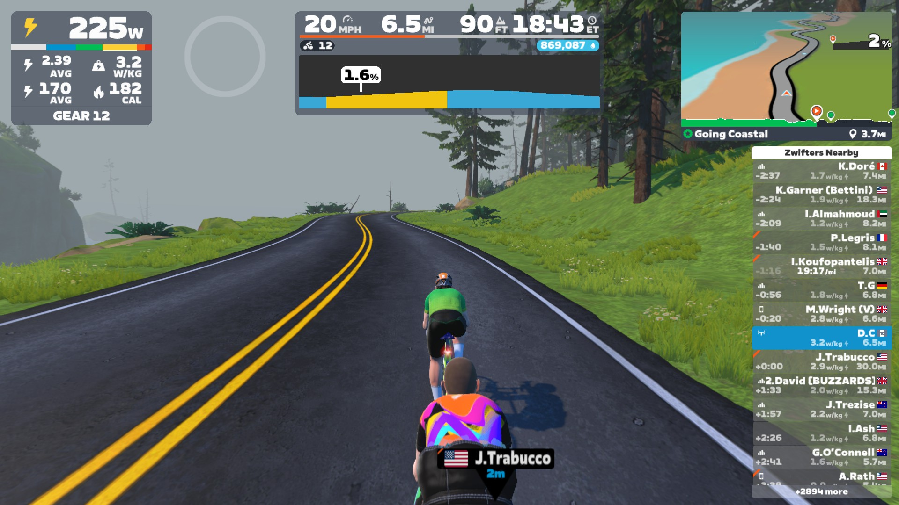

I like Zwift, but their clickers never work, so I made my own.

Source: [DimitriChrysafis/ZwiftShifter](https://github.com/DimitriChrysafis/ZwiftShifter)



## What I tried

- Keyboard shortcuts: virtual shifting only comes through the controller path, not the keyboard
- Fake gamepad: rejected as `ZP User Input`
- Second BLE connection: risky, can disturb the live Click

## Find the Bluetooth path

Zwift logs everything to `~/Documents/Zwift/Logs/Log.txt`:

```sh
grep -n "ZP User Input" "$HOME/Documents/Zwift/Logs/Log.txt"
grep -n "Zwift Click" "$HOME/Documents/Zwift/Logs/Log.txt"
grep -n "FC82" "$HOME/Documents/Zwift/Logs/Log.txt"
grep -n "virtual shifting" "$HOME/Documents/Zwift/Logs/Log.txt"
grep -n "firmware version" "$HOME/Documents/Zwift/Logs/Log.txt"
```

Log looks like:

```text
... adding component type: 23 (BLE)
... Device selected for role ... ZP User Input
... Zwift Click ... connected
... Did discover service ... FC82
... firmware version: 1.1.0
... Comms established with Zwift Click
... Requesting input configuration
... Enabled virtual shifting on KICKR CORE
```

<div class="post12-signal-grid">
  <div><strong>FC82</strong></div>
  <div><strong>BC2 / Click v2</strong></div>
  <div><strong>ZP User Input</strong></div>
</div>

`FC82` = Bluetooth service, `BC2 / Click v2` = controller, `ZP User Input` = role. Click v2 sends buttons over `0x23`. (Click v1's `0x37` — accepted, ignored.)

## Where did MY message go???

Click data lands in an Objective-C method:

```text
BridgeInterface
addCharacteristicNotificationEvent:
    serviceId:
    characteristicId:
    characteristicFlags:
    value:
    length:
```

Everything BLE goes through it. Example, battery event:

```text
service         FC82
characteristic  00000002-19CA-4651-86E5-FA29DCDD09D1
flags           0x10
value           19 10 64
length          3
```

Click v2 sends a 32-bit button map, bits inverted: 1 = released, 0 = pressed.

Tried values while watching the HUD. Two bits mattered:
- clearing `0x0200` = one gear easier
- clearing `0x1000` = one gear harder

After a press, send all bits back to 1.

```text
easier:  23 08 ff fb ff ff 0f
harder:  23 08 ff df ff ff 0f
release: 23 08 ff ff ff ff 0f
```

## Timing matters

Press+release at the same instant = several shifts at once. Works:

| time | action |
| --- | --- |
| t0 | press |
| t0 + 80 ms | release |
| t0 + 160 ms | ready |

Debugger on every click pauses the game. So, once:

<div class="post12-bridge">
  <div><strong>load a small dylib into Zwift <em>(once)</em></strong></div>
  <div><strong>grab the receiver <em>(once)</em></strong></div>
  <div><strong>restore the original method <em>(then)</em></strong></div>
  <div><strong>send a press when told to <em>(always)</em></strong></div>
</div>


