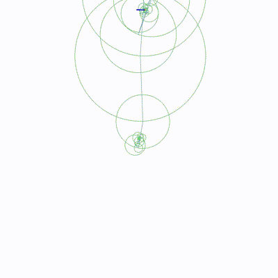
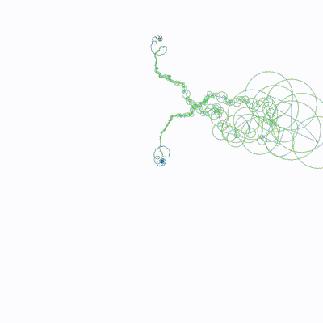

# Fourier Fun
---
 

### **What is a Fourier Series?** 

You know what the Fourier Series is. I take a function and break it into sines and cosines.
Unless it's even or odd, in which case odd functions only give sine terms and even functions only give cosine terms.
General case is both though.

 

### Mathematical Definition:

For a periodic function $f(x)$ with a period $T$, the Fourier series is written as:

$$
f(x) = \frac{a_0}{2} + \sum_{n=1}^{\infty} \left( a_n \cos(n \omega_0 x) + b_n \sin(n \omega_0 x) \right)
$$

Where:

- $a_0$  is the **DC component** AVERAGE VALUE OVER A PERIOD
- $a_n$ and $b_n$ are the **Fourier coefficients**, determining how much sin there is and how much cos there is
- $\omega_0 = \frac{2\pi}{T}$ is the **fundamental angular frequency** (the smallest frequency of the function).

 

### Fourier Coefficients:

The **Fourier coefficients** ($a_n$ and $b_n$) tell us how much each sine and cosine wave contributes to approximating my function.

1. **$a_0$** — The average value of the function over one period:

   $$
   a_0 = \frac{2}{T} \int_0^T f(x) \, dx
   $$

   This represents the **DC component** or the average
 

2. **$a_n$** — The coefficients for the cosine terms:

   $$
   a_n = \frac{2}{T} \int_0^T f(x) \cos(n \omega_0 x) \, dx
   $$

   Models the even symmetry 
 

3. **$b_n$** — The coefficients for the sine terms:

   $$
   b_n = \frac{2}{T} \int_0^T f(x) \sin(n \omega_0 x) \, dx
   $$

   Captures the odd symmetry
 
---

### **How Does the Fourier Series Approximation Work Art?**

 

<video width="600" controls>
  <source src="../media/post2/helloworld.mp4" type="video/mp4">
  Your browser does not support the video tag.
</video>

THE CONTENT IN RED ABOVE IS THE MAIN FOCUS ^

 

THIS CONTENT IN BLUE WILL NOT BE COVERED BECAUSE IT WAS EXPLAINED IN MY GITHUB PAGE

|   |   |
|-------------------------------------------------------|-----------------------------------------------------|
|    |  |

 

You can find the code in the [BonusCode.py](https://github.com/DimitriChrysafis/FourierDrawer/blob/main/BonusCode.py) file.

 

If you understood the first 2 pages. You should understand this. The basic idea is to 
**calculate the Fourier coefficients** for the given function and then **sum the sine and cosine terms** 
to approximate the function. Increase the value of N to get a more accurate representation of your function.

 

#### 1. **Basic Setup**

 

Use the formula from way back up

 

$$
f(x) \approx \frac{a_0}{2} + \sum_{n=1}^{N} \left( a_n \cos(n \omega_0 x) + b_n \sin(n \omega_0 x) \right)
$$

Each term $f_n(x) = a_n \cos(n \omega_0 x) + b_n \sin(n \omega_0 x)$ adds more detail to the approximation.

 

However, how did I get such smooth movement between the frames? The method i'm describing should create a choppy video?

 

### **Smooth Interpolation Logic**

 

Smooth interpolation is achieved using an **easing function** to control how the animation transitions between frames. The goal is to gradually increase the number of Fourier coefficients in a way that feels natural, avoiding abrupt starts or stops.

 

### 1. Normalized Time
Let $t$ be the normalized time:

$$
t = \frac{\text{current frame}}{\text{total frames} - 1}
$$

where $t \in [0, 1]$. This makes sure the interpolation progresses uniformly from the start ($t = 0$) to the end ($t = 1$).

 

### 2. Easing Function

 

The easing function controls the progression of $K(t)$, the number of coefficients used at any given frame. A **cubic easing function** is used for smooth acceleration and deceleration:

 

#### a. Acceleration Phase ($t \in [0, 0.5]$)
During the first half of the animation, the function starts slow and accelerates:

$$
\text{interpolation}(t) = 4t^3.
$$

- At $t = 0$: $\text{interpolation}(t) = 0$.
- At $t = 0.5$: $\text{interpolation}(t) = 0.5$.

This ensures a gentle start with increasing speed.

 

#### b. Deceleration Phase ($t \in [0.5, 1]$)
During the second half, the function decelerates as it approaches the end:

$$
\text{interpolation}(t) = 1 - \frac{(-2t + 2)^3}{2}.
$$

- At $t = 0.5$: $\text{interpolation}(t) = 0.5$.
- At $t = 1$: $\text{interpolation}(t) = 1$.

This creates a smooth slowing down towards the final frames.

 

### 3. Interpolated Number of Coefficients
using the easing function then the number of coefficients $K(t)$ at time $t$ is given by:

$$
K(t) = \text{maxCoeffs} \cdot \text{interpolation}(t)
$$

where $\text{maxCoeffs}$ is the total number of Fourier coefficients available.

 

---

 

### **Practical Example: Approximating a Square Wave and Sawtooth Wave**

 

#### 1. **Square Wave Approximation**

This is a square wave: 

<video width="600" controls>
  <source src="../media/post2/squarewave.mp4" type="video/mp4">
  Your browser does not support the video tag.
</video>

[Original Source Here](https://www.shadertoy.com/view/ldBGzy)

 

$$
f(x) = \frac{4}{\pi} \left( \sin(\omega_0 x) + \frac{1}{3} \sin(3 \omega_0 x) + \frac{1}{5} \sin(5 \omega_0 x) + \cdots \right)
$$

or

$$
f(x) = \frac{4}{\pi} \sum_{n=0}^{\infty} \frac{1}{2n+1} \sin((2n+1)\omega_0 x)
$$

 

NOTE that ONLY **odd harmonics** (1st, 3rd, 5th, etc.) are present. BECAUSE the square wave is an **odd function**, and only sine terms (which are odd functions) contribute to it!!

 

Excercise for the reader: learn about **Gibbs phenomenon** overshoot by 9%!

 

As you add more terms, the wave function starts to match the true square wave more closely, reducing the round-off errors at the transitioning posts/areas.

 

---

 

#### 2. **Sawtooth Wave Approximation**

 

A **sawtooth wave** has a linear rise over time, followed by a sharp drop, repeating this pattern periodically. Its Fourier series expansion includes **both sine and cosine terms**, unlike the square wave that only contains sine terms:

<video width="600" controls>
  <source src="../media/post2/sawtooth.mp4" type="video/mp4">
  Your browser does not support the video tag.
</video>

[Original Source Here](https://www.shadertoy.com/view/ldBGzy)

$$
f(x) = \frac{2}{\pi} \left( \sin(\omega_0 x) + \frac{1}{2} \sin(2 \omega_0 x) + \frac{1}{3} \sin(3 \omega_0 x) + \cdots \right)
$$

 

$$
f(x) = \frac{2}{\pi} \sum_{n=1}^{\infty} \frac{1}{n} \sin(n \omega_0 x)
$$

 

---

 

[Fourier Series Animation on CodePen](https://codepen.io/anon/pen/jPGJMK)
