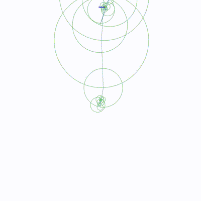
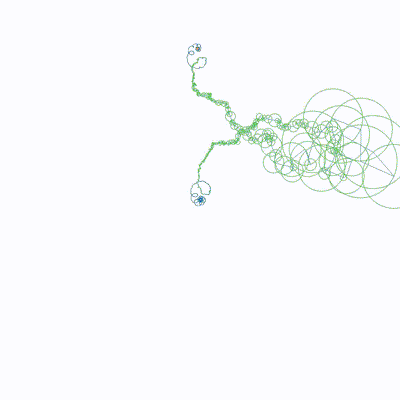

# Fourier Fun
---

This post is mostly about the demos.
The idea is simple: a periodic signal or closed drawing can be rebuilt by stacking rotating sine/cosine terms.
More terms means more detail.

## The main drawing demo

<video width="600" controls>
  <source src="../media/post2/helloworld.mp4" type="video/mp4">
  Your browser does not support the video tag.
</video>

The red path is the part to watch.
As more Fourier terms are added, the reconstruction locks onto the drawing.

The approximation is

$$
f(x) \approx \frac{a_0}{2} + \sum_{n=1}^{N} \left( a_n \cos(n \omega_0 x) + b_n \sin(n \omega_0 x) \right)
$$

with

$$
\omega_0 = \frac{2\pi}{T}
$$

and coefficients

$$
a_n = \frac{2}{T} \int_0^T f(x) \cos(n \omega_0 x) \, dx,
\qquad
b_n = \frac{2}{T} \int_0^T f(x) \sin(n \omega_0 x) \, dx
$$

That is the whole game: measure the coefficients, then add the waves back together.

The blue examples below use the same idea on different shapes.

|   |   |
|-------------------------------------------------------|-----------------------------------------------------|
|    |  |

Code for this version is in [BonusCode.py](https://github.com/DimitriChrysafis/FourierDrawer/blob/main/BonusCode.py).

## Why the animation looks smooth

If I just jump from 5 terms to 10 to 15, the video looks choppy.
So I ease the number of active coefficients over time instead.

Let

$$
t = \frac{\text{current frame}}{\text{total frames} - 1}
$$

and use a smooth easing curve to choose how many terms are active:

$$
K(t) = \text{maxCoeffs} \cdot \text{interpolation}(t)
$$

Same math, better motion.

## Square wave demo

<video width="600" controls>
  <source src="../media/post2/squarewave.mp4" type="video/mp4">
  Your browser does not support the video tag.
</video>

[Original Source Here](https://www.shadertoy.com/view/ldBGzy)

A square wave is a nice example because the Fourier series is very clean:

$$
f(x) = \frac{4}{\pi} \sum_{n=0}^{\infty} \frac{1}{2n+1} \sin((2n+1)\omega_0 x)
$$

Only odd harmonics show up.
As you add terms, the corners sharpen, but you still get the usual Gibbs overshoot near the jumps.

## Sawtooth wave demo

<video width="600" controls>
  <source src="../media/post2/sawtooth.mp4" type="video/mp4">
  Your browser does not support the video tag.
</video>

[Original Source Here](https://www.shadertoy.com/view/ldBGzy)

The sawtooth keeps every harmonic:

$$
f(x) = \frac{2}{\pi} \sum_{n=1}^{\infty} \frac{1}{n} \sin(n \omega_0 x)
$$

So the reconstruction fills in detail more gradually across all frequencies.

---

[Fourier Series Animation on CodePen](https://codepen.io/anon/pen/jPGJMK)
