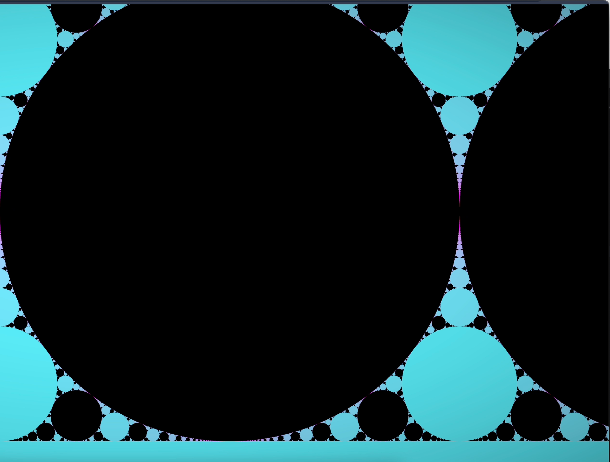

# Newton's fractal
I'm not going to sit here and explain everything about fractals. School has started. Go read a 3b1b post for a quality post.
This post is merely a placeholder for me to showcase my work.

## Click urls below for live demo. ON NEWTONS FRACTAL CLICK TO INTERACT
 https://dimitrichrysafis.github.io/media/post6/index.html
 https://dimitrichrysafis.github.io/media/post6/newton.html

<iframe src="media/post6/newton.html" width="700" height="400"></iframe>
<iframe src="media/post6/index.html" width="700" height="400"></iframe>

<video width="700" controls>  
  <source src="../media/post6/bulb.mp4" type="video/mp4">
</video>  
