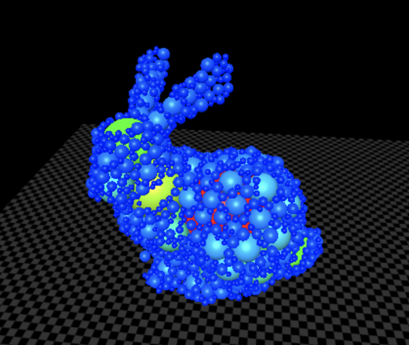

# Sphere Packing inside Arbitrary Meshes
### SRC: [SpherePacking](https://github.com/DimitriChrysafis/SpherePacking)

## Demos

[Bunny](../media/post8/bunny.html) · [Dragon](../media/post8/dragon.html) · [Ogre](../media/post8/ogre.html) · [Binary Search](../media/post8/animation.html)

  <iframe
    src="../media/post8/bunny.html"
    title="Sphere packing inside the Stanford Bunny"
    style="position: absolute; top:0; left:0; width:100%; height:100%; border:none;"
    scrolling="no">
  </iframe>

 

## The loop

GPU kernels batch the ray/triangle tests, nearest-surface distance queries, and candidate checks.
The first stage is global: it finds a safe, large seed anywhere in the mesh. The second stage is local: each new sphere grows from an existing one until a constraint becomes active.

## 1. Inside or outside

For a watertight mesh, cast a non-degenerate ray from $O$ through $P$.

The parity rule is then

Each ray kernel returns $(t,u,v)$. Only forward hits with valid barycentric coordinates contribute to the parity count; shared edge and vertex hits need a consistent tie-break rule.

For Möller–Trumbore:

## 2. Largest interior sphere

Sample the interior on a grid $G$. For every interior point, measure the distance to the triangle surface. The seed is the point with the largest such distance.

That radius is a conservative upper bound for every later sphere. This global pass avoids committing the solver to the first local gap it sees.

## 3. Tangent expansion

From an accepted sphere $(C_a,r_a)$, choose a unit direction $\hat d$ and solve for the next radius. As $r$ grows, the candidate center moves outward by exactly the same amount, so the new sphere stays tangent to its anchor.

The two spheres touch because

For a valid/invalid bracket $[L,H]$ around the first failed radius:

The containment term keeps the center inside the mesh. The clearance term prevents surface penetration. The last term rejects overlap with every sphere already accepted into the packing. The output is a hierarchy of large interior spheres followed by progressively smaller gap-filling spheres, all using the same compact GPU-friendly tests.

## Result

